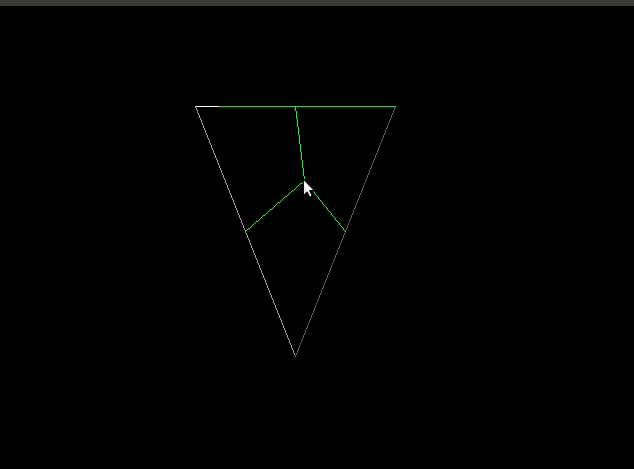

# Part 0 - Point in a Triangle Demo

## Description

In this portion, there is some demo code for showing how to determine if a point is in a triangle. From a programming standpoint, there is not too much to do here other than learn from the code and play around a bit as you choose.

### Some highlights in the code

- [PrintVector](./src/main.cpp#L23) is a handy function for just understanding what is going on in your code.
  - In C++ you can overload the << (stream operator with operator<<) if you like, but anything that can help you debug will do the job just fine.
  - Did you know you can call functions in gdb as well? gdb is really neat and beats just sprinkling 'print' statements everywhere ;)
- using Point = Vector2f
  - Handy sometimes to write aliases in your code.
- isLeft
  - This is a handy function for determining the orientation of a point against a line segment
  - The whole purpose of this demo is to show you how to determine if a point is in a triangle.
  - CrossProduct is another tool that can be used as well for this!
- Orientation matters for how we traverse vertices (whether clockwise or counterclockwise)
  - In this course, I will use counterclockwise (it's more common in the OpenGL grpahics API) as the convention.

### Exercise

Part of this course is theory, part of this course is application, and part of this course will evolve to research. I'd like to kick start that journey for you by completing the [exercise.md](./exercise.md). Click the exercise.md file to begin.
